[English](README.en.md) | **简体中文**

<picture>
  <source media="(max-width: 640px) and (prefers-color-scheme: dark)" srcset="assets/presentation/hero-mobile-dark.svg">
  <source media="(max-width: 640px)" srcset="assets/presentation/hero-mobile-light.svg">
  <source media="(prefers-color-scheme: dark)" srcset="assets/presentation/hero-dark.svg">
  
</picture>

**从历史笔记提取可读的写作特征，标出套路词与标点堆叠，再逐句改写和回检。**

`v0.7.0` · `Python 3.12+` · [Apache-2.0](LICENSE)

[Website](https://voicelock.lei6393.com) · [Demo record](docs/demo-results.json)

## 为什么使用

草稿中的夸张开头、重复流行词和密集表情，可能与你平时的表达不同。voicelock 把历史笔记转成统计档案，让你查看具体差异和被标出的句子。这里的“声线”指文本写作特征，不涉及录音或声音克隆。

## 架构

<picture>
  <source media="(max-width: 640px) and (prefers-color-scheme: dark)" srcset="assets/presentation/architecture-mobile-dark.svg">
  <source media="(max-width: 640px)" srcset="assets/presentation/architecture-mobile-light.svg">
  <source media="(prefers-color-scheme: dark)" srcset="assets/presentation/architecture-dark.svg">
  
</picture>

voiceprint 用 jieba 与文本统计构建 VoiceProfile；slop_detector 标注句级规则命中；rewriter 调用明确选择的后端，对每句回检并保留分数更低的候选。默认 mock 是词法替换，llm 使用配置的 OpenAI 兼容服务；重新拼接时保留段落间隔。

源码入口：[src/voicelock/cli.py](src/voicelock/cli.py) · [src/voicelock/config.py](src/voicelock/config.py) · [src/voicelock/voiceprint.py](src/voicelock/voiceprint.py) · [src/voicelock/slop_detector.py](src/voicelock/slop_detector.py) · [src/voicelock/rewriter.py](src/voicelock/rewriter.py) · [src/voicelock/backends/mock.py](src/voicelock/backends/mock.py) · [src/voicelock/models.py](src/voicelock/models.py)

## 安装

需要 Python 3.12+ 与 uv。示例强制使用 mock 词法后端，即便机器已配置模型密钥也不会调用服务。

```bash
git clone https://github.com/SuperMarioYL/voicelock.git
cd voicelock
uv venv --python 3.12
uv pip install --python .venv/bin/python -e .
```

## 快速开始

输入为仓库自带的四篇合成笔记与草稿。脚本计算档案、执行离线词法改写并回检。分数衡量当前规则命中，不是人类质量评测、AI 作者概率或平台推荐效果。

```bash
.venv/bin/python examples/presentation-demo.py
```

完整输入与执行步骤见上方命令及 [Demo 记录](docs/demo-results.json)。

## 使用

```bash
.venv/bin/voicelock fingerprint --corpus examples/my-posts.txt --account example
.venv/bin/voicelock voice-distance examples/draft.txt --account example
.venv/bin/voicelock audit examples/draft.txt --account example
.venv/bin/voicelock rewrite examples/draft.txt --account example --backend mock
```
多篇语料用空行分隔。CLI 要求至少两篇、200 字，低于门槛会拒绝建档；这只是最低输入要求，不是统计质量保证。`--iters` 控制每个命中区域的改写次数。

## 实际 Demo

<picture>
  <source media="(max-width: 640px) and (prefers-color-scheme: dark)" srcset="assets/presentation/process-mobile-dark.svg">
  <source media="(max-width: 640px)" srcset="assets/presentation/process-mobile-light.svg">
  <source media="(prefers-color-scheme: dark)" srcset="assets/presentation/process-dark.svg">
  
</picture>

### 查看实际改写

输出保留原稿、改稿、规则分数与尝试次数；分数降低不保证句子更自然。

```text
$ .venv/bin/python examples/presentation-demo.py
{
  "corpus_posts": 4,
  "corpus_chars": 221,
  "backend": "mock",
  "before": "姐妹们！！！这家咖啡馆真的绝绝子😭😭😭\n谁懂啊家人们直接封神yyds！！！\n手把手教你三步找到宝藏咖啡馆，建议收藏码住🔥🔥🔥\n错过血亏，闭眼入不踩雷～～～",
  "after": "这家咖啡馆真的很不错。\n非常好很顶。\n三步找到宝藏咖啡馆，建议收藏码住。\n值得看看，可以放心买不踩雷。",
  "rule_score_before": 100.0,
  "rule_score_after": 0.0,
  "rewrite_attempts": 5
}
```

## 能力与接入

<picture>
  <source media="(max-width: 640px) and (prefers-color-scheme: dark)" srcset="assets/presentation/integrations-mobile-dark.svg">
  <source media="(max-width: 640px)" srcset="assets/presentation/integrations-mobile-light.svg">
  <source media="(prefers-color-scheme: dark)" srcset="assets/presentation/integrations-dark.svg">
  
</picture>

fingerprint 建档，voice-distance 展示统计一致性与差异最大的维度，audit 只标注，rewrite 输出 before/after。它不登录、抓取或发布笔记；接入 llm 时会把相应文本发送给所配置的服务。


## 配置

`VOICELOCK_HOME` 默认 `~/.voicelock`，默认档案为 voice.yaml，多账号为 voice.<account>.yaml。后端优先级为 --backend、VOICELOCK_BACKEND，再按是否存在 VOICELOCK_API_KEY 自动选择。显式 llm 无密钥会报错；VOICELOCK_BASE_URL 与 VOICELOCK_MODEL 指定服务。voice-distance 当前会输出贡献最大的三个差异维度。

## 路线图与范围

当前包含统计档案、句级规则、差异分解以及两个改写后端。自定义规则、档案可视化、团队协作与托管界面是后续方向。

- 规则分数不是“AI 检测器”，不能证明一段文字由人或模型创作。
- 未验证任何平台限流、推荐或曝光变化；改写仍需检查事实、含义与个人表达。

 · [Recording script](docs/demo.tape)

## 许可证

[Apache-2.0](LICENSE)
