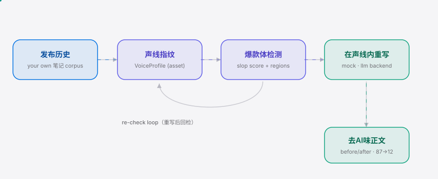

<div align="right"><sub><a href="./README.en.md">English</a>&nbsp;&nbsp;⇄&nbsp;&nbsp;<b>简体中文</b></sub></div>

<p align="center">
  <picture>
    <source media="(prefers-color-scheme: dark)" srcset="./assets/hero-dark.svg">
    <source media="(prefers-color-scheme: light)" srcset="./assets/hero-light.svg">
    
  </picture>
</p>

<p align="center"><sub>把 AI 副驾写出来的『一眼AI』爆款体正文，改写回你自己账号的声线。</sub></p>

<p align="center">
  <a href="./LICENSE"></a>
  <a href="https://github.com/SuperMarioYL/voicelock/releases"></a>
  <a href="https://github.com/SuperMarioYL/voicelock/actions/workflows/ci.yml"></a>
  
  
  
</p>

**你的 AI 副驾写出来的正文一眼就是『爆款体』——姐妹们、绝绝子、yyds、感叹号轰炸——小红书对这种同质化正文限流；voicelock 从你自己的发布历史学出『账号声线指纹』，检测并逐句退火掉这些爆款体区域，把正文改写回你本人的声线。**

`voicelock` 是给小红书图文创作者的 **去AI味** 工具。它不是又一个『一次性 prompt 让 AI 学我说话』——它把你的声线**指纹化成一个你拥有的资产**（从你自己的往期笔记学出统计签名），再用『检测 → 在声线内重写 → 回检』的闭环，把爆款体正文改回你本人的表达。灵感来自 [Leonxlnx/taste-skill](https://github.com/Leonxlnx/taste-skill)（57k★，"stops the AI from generating boring, generic slop"）在开发者侧点燃的 **去AI味 / anti-slop** 浪潮——voicelock 补上它缺的那一半：**小红书正文** 这个平面 + **账号声线指纹**。默认离线（`mock` 后端，零 API key），想要更高质量再切到 qwen/doubao/kimi/glm。

<h2> 架构</h2>

<p align="center">
  <picture>
    <source media="(prefers-color-scheme: dark)" srcset="./assets/atlas-dark.svg">
    <source media="(prefers-color-scheme: light)" srcset="./assets/atlas-light.svg">
    
  </picture>
</p>

单个 CLI 进程，离线优先，默认路径不联网：

- **发布历史 → 声线指纹**：`voiceprint` 用 jieba 分词，从你自己的往期笔记算出词汇多样度、句长分布、emoji 密度、标点节奏、开头习惯、签名高频词，组成一个可读、可版本化的 `VoiceProfile`（存到 `~/.voicelock/voice.yaml`）。
- **爆款体检测**：`slop_detector` 用一套针对小红书同质化开头/套路词/emoji 堆叠/标点轰炸的词法规则，标出句级 slop 区域并给 0–100 分数。
- **在声线内重写**：`rewriter` 对每个爆款体区域跑『重写 → 回检』循环，`mock`（离线词法）或 `llm`（OpenAI 兼容的国产模型）后端二选一，重写后回检不达标就再来一轮。

<h2> 安装 & 快速开始</h2>

冷启动到第一个可见结果，三条命令，全程离线、无需 API key：

```bash
pip install voicelock                                    # 或 uvx voicelock（免安装试用）
voicelock fingerprint --corpus examples/my-posts.txt     # 从你自己的往期笔记学声线指纹
voicelock rewrite examples/draft.txt                     # 把 AI 草稿逐句改回你的声线
```

<details><summary>示例输出（rewrite）</summary>

```
╭──────────────── voicelock rewrite ────────────────╮
│ slop  100 → 0   backend=mock   声线一致性 0.95     │
╰────────────────────────────────────────────────────╯
before   这家咖啡馆真的绝绝子😭😭😭
after    这家咖啡馆真的很不错。
slop     65 → 0  (homogenized_phrase, ×1)
...
╭──────────── 改写后正文 (去AI味) ────────────╮
│ 这家咖啡馆真的很不错。非常好很顶。三步找到 │
│ 宝藏咖啡馆，建议收藏码住。值得看看，可以放 │
│ 心买不踩雷。                                │
╰──────────────────────────────────────────────╯
```
</details>

<h2> 用法</h2>

四个子命令覆盖『建资产 → 检测 → 重写』全流程（示例见 [`examples/`](./examples)）：

```bash
# 1. 学声线指纹（一次性，之后复用）——支持多账号
voicelock fingerprint --corpus my-posts.txt --account main

# 2. 只看草稿有多像你（0..1 一致性，越高越像）
voicelock voice-distance draft.txt --account main

# 3. 只检测不重写：标出爆款体区域 + slop 分数
voicelock audit draft.txt --account main

# 4. 逐句在你声线内重写：before/after diff + slop 变化
voicelock rewrite draft.txt --account main
```

切换到国产模型后端（更高质量重写），设三个环境变量即可，无 key 时自动回落到离线 `mock`：

```bash
export VOICELOCK_API_KEY=sk-...
export VOICELOCK_BASE_URL=https://dashscope.aliyuncs.com/compatible-mode/v1   # qwen 示例
export VOICELOCK_MODEL=qwen-plus                                             # 或 doubao / kimi / glm
voicelock rewrite draft.txt --backend llm
```

> 隐私：voicelock 只处理**你自己粘贴/导出的公开笔记**——不抓取、不自动发布、不登录会话。你的声线指纹存在本地，是你拥有的资产。

<h2> Demo</h2>

一条爆款体草稿（slop 87）被逐句改回账号声线，分数一路降到 12，声线一致性拉满：


<h2> 配置</h2>

全部通过环境变量配置，默认零配置离线可用：

| 变量 | 类型 | 默认 | 含义 |
|---|---|---|---|
| `VOICELOCK_BACKEND` | `mock` \| `llm` | 有 key 则 `llm`，否则 `mock` | 强制选择后端 |
| `VOICELOCK_API_KEY` | string | *(空)* | 国产模型 API key；留空即离线 mock |
| `VOICELOCK_BASE_URL` | url | dashscope 兼容端点 | OpenAI 兼容 base_url（qwen/doubao/kimi/glm） |
| `VOICELOCK_MODEL` | string | `qwen-plus` | 模型名 |
| `VOICELOCK_HOME` | path | `~/.voicelock` | 声线指纹与配置的存放目录 |

<h2> 路线图</h2>

- [x] **m1** 账号声线指纹（`VoiceProfile`）+ 声线一致性距离评分（离线）
- [x] **m2** 爆款体/同质化检测：句级 slop 区域标注 + before/after slop 分数
- [x] **m3** 在声线内重写闭环（mock + llm 后端 + 回检）+ CLI + 动态 demo
- [ ] 更细的爆款体规则库 + 可自定义规则集
- [ ] 声线指纹的可视化报告（导出 SVG/HTML）
- [ ] 托管无代码版（非开发者创作者）+ MCN 多账号团队版（见下方付费）

<h2> 付费 / Pricing</h2>

**v0.1 的 CLI 是免费开源的**——它是需求验证，也是下面托管层的地基，不设付费墙。

真正的商业化在托管层（把同一套 `voiceprint`/`slop_detector`/`rewriter` 包成无代码服务）：

| 层 | 面向 | 规划定价 | 内容 |
|---|---|---|---|
| CLI（本仓库） | 会用命令行的开发者/独立创作者 | 免费 OSS | 全部 v0.1 能力，离线 mock |
| 单人版（托管） | 非开发者创作者 | ¥19 / 月 | 云端声线指纹 + 重写额度，无需命令行 |
| MCN 团队版 | 多账号 PGC / MCN 工作室 | ¥99 / 账号 / 月 | 每账号独立声线 + 团队额度 + 跨账号一致性看板 |

> 定价为规划值：小红书 MCN 工具普遍 ¥几百–几千/月，团队版定在 ¥99/账号/月 以先拿下前几家。托管层是 post-MVP，本仓库只交付它所包裹的资产与闭环。

<h2> License & 贡献</h2>

[MIT](./LICENSE) 开源。欢迎提 [Issue](https://github.com/SuperMarioYL/voicelock/issues) 或 PR——尤其是爆款体规则的补充、以及不同账号声线的样例。

## Share this

```
voicelock — 去AI味 / anti-slop taste for 小红书 正文. Learns your account-voice
fingerprint from your own posts and rewrites AI drafts in your voice. Offline,
no API key. https://github.com/SuperMarioYL/voicelock
```

<p align="center"><sub><a href="./LICENSE">MIT</a> © 2026 SuperMarioYL</sub></p>
